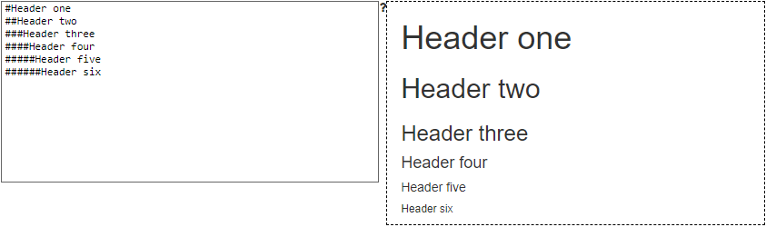

Markdown 기본 문법을 정리하였다. 출처는 `http://markdowntutorial.com`이다.  
이 게시물도 Markdown 언어로 작성하고 있는데, 앞으로 자주 쓰게 될 것 같다.

### 1. italic: _  
   예: `_italic_`

### 2. bold: **  
   예: `**bold**`

### 3. Headers: `#`


**Here is some bold text**

## Here is a secondary heading

Here's a useless table:

| Number | Next number | Previous number |
| :------ |:--- | :--- |
| Five | Six | Four |
| Ten | Eleven | Nine |
| Seven | Eight | Six |
| Two | Three | One |


How about a yummy crepe?


It can also be centered!

{: .center-block :}

Here's a code chunk:

~~~
var foo = function(x) {
  return(x + 5);
}
foo(3)
~~~

And here is the same code with syntax highlighting:

```javascript
var foo = function(x) {
  return(x + 5);
}
foo(3)
```

And here is the same code yet again but with line numbers:


var foo = function(x) {
  return(x + 5);
}
foo(3)


## Boxes
You can add notification, warning and error boxes like this:

### Notification

{: .box-note}
**Note:** This is a notification box.

### Warning

{: .box-warning}
**Warning:** This is a warning box.

### Error

{: .box-error}
**Error:** This is an error box.
